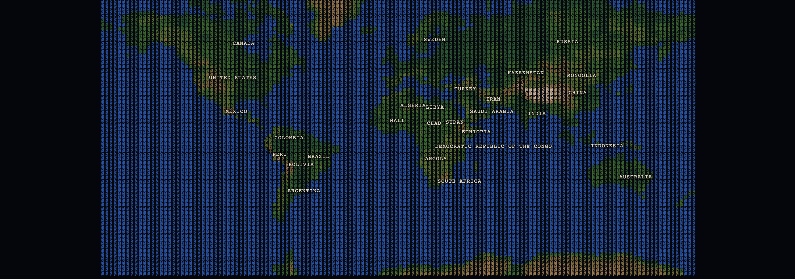

# glyphcss

ASCII polygon-mesh renderer for the DOM — projects 3D meshes into a monospace character grid in a single `<pre>`. No WebGL, no canvas, no per-polygon DOM.



Loads OBJ, glTF, GLB, and MagicaVoxel `.vox` files. Supports wireframe, solid, and voxel render modes with swappable glyph palettes.

> Forked from [polycss](https://github.com/LayoutitStudio/polycss) — the mesh math, parsers (OBJ / glTF / GLB / VOX), scene composition tree, camera math, and input controls carried over intact. The paint backend is rewritten: instead of emitting one CSS-transformed DOM leaf per polygon, the rasteriser walks all polygons, fills a `cols × rows` character grid, and writes a single string to `<pre>.textContent` per render.

## Installation

```bash
# Vanilla / custom elements
npm install glyphcss

# React
npm install @glyphcss/react

# Vue 3
npm install @glyphcss/vue
```

You can also load glyphcss directly from a CDN. Here is a minimal custom-element scene:

```html
<script type="module" src="https://esm.sh/glyphcss/elements"></script>

<glyph-camera rot-x="65" rot-y="45">
  <glyph-scene>
    <glyph-orbit-controls></glyph-orbit-controls>
    <glyph-mesh src="/cottage.glb"></glyph-mesh>
  </glyph-scene>
</glyph-camera>
```

## Framework Components

React and Vue expose the same component model. `<GlyphCamera>` owns the viewpoint, `<GlyphScene>` owns the rasteriser options and lighting, and `<GlyphMesh>` loads or receives polygon data.

### React

```tsx
import {
  GlyphCamera,
  GlyphScene,
  GlyphOrbitControls,
  GlyphMesh,
} from "@glyphcss/react";

export default function App() {
  return (
    <GlyphCamera rotX={65} rotY={45}>
      <GlyphScene mode="solid" glyphPalette="default">
        <GlyphOrbitControls drag wheel />
        <GlyphMesh src="/gallery/obj/cottage.obj" />
      </GlyphScene>
    </GlyphCamera>
  );
}
```

### Vue

```vue
<template>
  <GlyphCamera :rot-x="65" :rot-y="45">
    <GlyphScene mode="solid" glyph-palette="default">
      <GlyphOrbitControls drag wheel />
      <GlyphMesh src="/gallery/obj/cottage.obj" />
    </GlyphScene>
  </GlyphCamera>
</template>

<script setup lang="ts">
import {
  GlyphCamera,
  GlyphScene,
  GlyphOrbitControls,
  GlyphMesh,
} from "@glyphcss/vue";
</script>
```

## Render Modes

Each render pass fills a `cols × rows` character grid and writes the result as a single string assignment to `<pre>.textContent` (or `innerHTML` when color spans are enabled).

| Mode | How cells are filled |
|---|---|
| `wireframe` | Polygon edges rasterised as ASCII rules; glyph weight scales with edge prominence |
| `solid` | Filled polygons; glyph picked from the palette's solid ramp by Lambert-shaded intensity |
| `voxel` | Cube-aligned geometry; face normals drive glyph selection |

### Glyph Palettes

The `glyphPalette` option selects a named character set used for both wireframe tiers and solid shading ramps. Built-in palettes:

`default`, `ascii`, `dots`, `lines`, `blocks`, `stars`, `arrows`, `braille`, `runes`, `math`, `binary`, `hex`

```tsx
<GlyphScene mode="wireframe" glyphPalette="braille">
  <GlyphMesh src="/model.glb" />
</GlyphScene>
```

## API Reference

### GlyphCamera

`GlyphCamera` is the ergonomic default — it resolves to `GlyphOrthographicCamera`. Use `GlyphPerspectiveCamera` for perspective depth.

| Prop | Type | Default | Description |
|---|---|---|---|
| `rotX` | `number` | `65` | Tilt angle in **degrees** |
| `rotY` | `number` | `45` | Spin angle in **degrees** |
| `zoom` | `number` | `0.65` | Absolute scale: `zoom=1` → one world unit = 50 px (`BASE_TILE`). Not a viewport fraction. |
| `center` | `[number, number]` | `[0.5, 0.5]` | Projection center in normalized grid coordinates |

`GlyphPerspectiveCamera` adds:

| Prop | Type | Default | Description |
|---|---|---|---|
| `distance` | `number` | `6` | Perspective distance in world units. Larger = flatter. |
| `stretch` | `number` | `1.0` | Extra horizontal scale on top of `cellAspect` |

`rotX=65, rotY=45` is the classic isometric-ish viewpoint. Rotation values are in degrees throughout (XYZ Euler) — there are no radians in the public API.

### GlyphScene

Must be placed inside a camera component.

| Prop | Type | Default | Description |
|---|---|---|---|
| `mode` | `"wireframe" \| "solid" \| "voxel"` | `"solid"` | Render mode |
| `glyphPalette` | `string` | `"default"` | Named glyph character set |
| `useColors` | `boolean` | `true` | Emit `<span>` color elements inside the `<pre>` |
| `cols` | `number` | `80` | Character grid width |
| `rows` | `number` | `24` | Character grid height |
| `cellAspect` | `number` | `2.0` | Cell height / width ratio |
| `directionalLight` | `GlyphDirectionalLight` | `{ direction: [-0.5,-0.7,-0.5], intensity: 1 }` | Key light |
| `ambientLight` | `GlyphAmbientLight` | `{ intensity: 0.4 }` | Fill light |
| `smoothShading` | `boolean` | `false` | Gouraud shading — interpolates Lambert intensity across vertices. Off by default (faceted ASCII look is intentional). |
| `creaseAngle` | `number` | `60` | Degrees — edges sharper than this stay flat even with `smoothShading` on |
| `autoSize` | `boolean` | `false` | Auto-measure the host element and adapt `cols`/`rows` to fill it via `ResizeObserver` |
| `shadow` | `GlyphShadowOptions` | `undefined` | Enable shadow mapping (see Shadows section) |

### GlyphMesh

| Prop | Type | Default | Description |
|---|---|---|---|
| `polygons` | `Polygon[]` | — | Pre-parsed geometry. Takes precedence over `src` and `geometry`. |
| `src` | `string` | — | URL of an OBJ, glTF, GLB, or VOX file (custom elements and `<glyph-mesh>` only; use `loadMesh` imperatively in React/Vue) |
| `geometry` | `GlyphGeometryName` | — | Built-in geometry shortcut (e.g. `"sphere"`, `"cube"`) |
| `size` | `number` | `1` | Uniform size passed to `resolveGeometry` |
| `color` | `string` | — | Fill color passed to `resolveGeometry` |
| `position` | `Vec3` | — | World-space translation |
| `rotation` | `Vec3` | — | XYZ Euler rotation in **degrees** |
| `scale` | `number \| Vec3` | — | Uniform or per-axis scale |
| `castShadow` | `boolean` | `false` | This mesh casts shadows onto `receiveShadow` surfaces |
| `receiveShadow` | `boolean` | `false` | This mesh receives (displays) shadows |

A mesh that is both `castShadow` and `receiveShadow` self-shadows.

### GlyphGround

Convenience ground plane — a horizontal `planePolygons` registered as a mesh.

| Prop | Type | Default | Description |
|---|---|---|---|
| `size` | `number` | `5` | Half-extent in world units |
| `color` | `string` | `"#444444"` | Fill color |
| `position` | `Vec3` | `[0, -0.5, 0]` | World-space position |
| `castShadow` | `boolean` | `false` | |
| `receiveShadow` | `boolean` | `true` | Ground planes are the primary shadow receivers |

### Controls

| Component | Behaviour |
|---|---|
| `GlyphOrbitControls` | Drag orbit, shift-drag pan, wheel zoom, optional auto-rotate |
| `GlyphMapControls` | Pan-first map-style input |
| `GlyphFirstPersonControls` | Keyboard and pointer-look navigation |

Props accepted by all controls: `drag`, `wheel`, `touch`.

### Hotspots

`GlyphHotspot` is a 3D anchor that produces an absolutely-positioned DOM overlay tracking a world-space point. The rasteriser projects the `at` coordinate to a grid cell; glyphcss positions a `<div>` over that cell. Children are portalled inside that div.

```tsx
<GlyphHotspot id="label-a" at={[0, 2, 0]}>
  <span className="label">Summit</span>
</GlyphHotspot>
```

| Prop | Type | Description |
|---|---|---|
| `id` | `string` | Stable identifier |
| `at` | `Vec3` | World-space anchor |
| `size` | `[number, number]` | Hitbox size in character cells. Default `[1, 1]`. |

### Polygon Data Model

Each polygon describes one renderable face:

```ts
import type { Polygon } from "@glyphcss/core";

const polygons: Polygon[] = [
  {
    vertices: [[0, 0, 0], [1, 0, 0], [0, 1, 0]],
    color: "#f97316",
  },
  {
    vertices: [[0, 0, 0], [1, 0, 0], [1, 1, 0], [0, 1, 0]],
    color: "#3b82f6",
  },
];
```

Polygons can also carry UV coordinates and `TextureTriangle` data for texture-mapped meshes (loaded via OBJ/MTL or glTF).

Pass `polygons` directly to a `GlyphScene` (imperative API) or a `GlyphMesh` component:

```tsx
<GlyphCamera rotX={65} rotY={45}>
  <GlyphScene>
    <GlyphMesh polygons={polygons} />
  </GlyphScene>
</GlyphCamera>
```

## Shadows

Shadows are opt-in. Enable them by setting `shadow` on `<GlyphScene>`, then flag individual meshes with `castShadow` and/or `receiveShadow`. glyphcss uses a shadow-map technique — renders depth from the light direction, then compares per cell — rather than an analytic projection.

```tsx
<GlyphScene
  shadow={{ color: "#000000", opacity: 0.35, lift: 0.05, maxExtend: 2000 }}
>
  <GlyphMesh src="/tree.glb" castShadow />
  <GlyphGround receiveShadow />
</GlyphScene>
```

| Option | Type | Default | Description |
|---|---|---|---|
| `shadow.color` | `string` | `"#000000"` | Shadow tint hex color |
| `shadow.opacity` | `number` | `0.25` | Darkness 0–1 toward `color` |
| `shadow.lift` | `number` | `0.05` | Depth bias — prevents self-shadow acne on flat lit surfaces |
| `shadow.maxExtend` | `number` | `2000` | Half-extent of the light-space projection volume |

## Loading Mesh Files

Use `loadMesh()` from `@glyphcss/core` to parse supported formats imperatively:

```ts
import {
  createGlyphScene,
  createGlyphOrthographicCamera,
  loadMesh,
} from "glyphcss";

const host = document.getElementById("scene")!;
const camera = createGlyphOrthographicCamera({ rotX: 65, rotY: 45 });
const scene = createGlyphScene(host, { camera });

const mesh = await loadMesh("/gallery/obj/cottage.obj");
scene.add(mesh.polygons);
```

In custom element HTML, set the `src` attribute directly — `<glyph-mesh>` fetches and parses the file automatically:

```html
<glyph-mesh src="/model.glb"></glyph-mesh>
<glyph-mesh src="/model.obj"></glyph-mesh>
<glyph-mesh src="/model.vox"></glyph-mesh>
```

In React and Vue, use `loadMesh` (from `@glyphcss/react` or `@glyphcss/vue`) and pass the parsed `polygons` to `<GlyphMesh>`:

```tsx
const { polygons } = await loadMesh("/model.glb");
<GlyphMesh polygons={polygons} />
```

Supported formats:

- OBJ + MTL, including `map_Kd` textures and UV coordinates
- glTF / GLB, including embedded images and `TEXCOORD_0`
- MagicaVoxel `.vox`, with face-culling and default or custom palettes

## Performance

glyphcss renders through a single `<pre>` element. The performance envelope is shaped by two things: the number of polygons walked per render and the size of the character grid written to the DOM.

Rendering is change-driven, not a fixed loop: a render is scheduled only when the camera or scene state actually changes, and multiple changes in the same tick are coalesced into a single pass. A static, un-interacted scene performs zero redraws. (Continuous animation — auto-rotate, inertia — does write every frame, but each frame is a genuinely different image.)

On every render pass:

1. All mounted meshes are walked in scene order.
2. Polygon vertices are transformed through the camera matrix to 2D projected positions.
3. A `cols × rows` character grid is filled: polygons are depth-tested, each cell picks a glyph from the active palette.
4. All cells are joined and written to `<pre>.textContent` (or `.innerHTML` for color mode) **exactly once**.

There are no per-polygon DOM elements and no CSS `matrix3d`. Hotspot overlays update via a single `el.style.left/top` assignment per hotspot per render — not a DOM rebuild.

`autoSize` uses a `ResizeObserver` to re-fit the grid whenever the host element resizes, keeping the character density constant regardless of viewport size.

## Packages

| Package | npm name | Description |
|---|---|---|
| `@glyphcss/core` | `@glyphcss/core` | Pure math: Vec3, Polygon, scene, camera, mesh ops, parsers. Zero browser globals. |
| `glyphcss` | `glyphcss` | ASCII rasteriser + vanilla custom elements + imperative `createGlyphScene` API. |
| `@glyphcss/react` | `@glyphcss/react` | React components, hooks, and controls. |
| `@glyphcss/vue` | `@glyphcss/vue` | Vue 3 mirror of the React package. |

## License

MIT.
