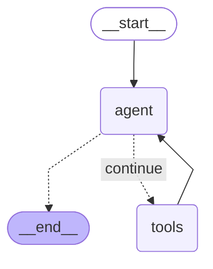

# @glyphcss/diagrams

2D Mermaid flowcharts and JSON graphs rendered into text cells for chat, terminals, and HTML. Layout and rendering are asynchronous. The pipeline uses the public glyphcss cell canvas, with no camera, scene, or DOM renderer.

> Layout and the examples below use the installed `@dagrejs/dagre@3.1.1`. `fixtures/langgraph-export.mmd` is the real, unmodified `draw_mermaid()` export byte-for-byte (including its `&nbsp;`-padded conditional edge text); `fixtures/langgraph.mmd` is a variant that makes agent→tools solid and keeps a labelled dotted edge to `__end__`.

```ts
import { renderGlyphDiagram } from "@glyphcss/diagrams";

const diagram = await renderGlyphDiagram(`flowchart LR
  request[Request] --> agent[Agent] --> answer[Answer]
`, { target: "chat", charset: "box", width: 80, height: 20 });
console.log(diagram.text);
console.log(diagram.report.ledger);
```

`renderGlyphDiagram` accepts Mermaid source or a `GlyphGraph`. `glyphGraphFromJson` accepts an object with `nodes` and `edges`, defaulting `direction` to `TB`. `renderGlyphDiagramJson` accepts JSON text and returns a Promise of JSON text: `{ text, html?, meta, report }` on success or `{ error, code, hint }` on failure.

React and Vue can call the diagram renderer from their own effect/mount hooks and display the result in a monospace `<pre>`. These 2D outputs do not need the scene components from `@glyphcss/react` or `@glyphcss/vue`. The website's `/diagrams` export window generates HTML, TypeScript, React, and Vue examples for Graph, Sequence, and Lanes; its framework examples ignore asynchronous results after unmounting and encode cell colors as browser HTML.

```ts
import { glyphGraphFromJson, renderGlyphDiagramJson } from "@glyphcss/diagrams";

const graph = glyphGraphFromJson({
  nodes: [{ id: "start", label: "Start" }, { id: "work", label: "Work", shape: "rounded" }],
  edges: [{ id: "run", from: "start", to: "work", label: "run", priority: 2 }],
  direction: "LR",
});
const encoded = await renderGlyphDiagramJson(JSON.stringify(graph), { target: "terminal" });
```

## Graph and source vocabulary

- Nodes: `{ id, label, kind?, group?, shape? }`. Shapes: `rect`, `rounded`, `diamond`, `circle`, `subroutine`, `asymmetric`, `stadium`; all reserve rectangular footprints, with cell-sized border distinctions.
- Edges: `{ id?, from, to, label?, style?, priority? }`. Styles: `solid`, `dotted`, `thick`, `undirected`. Larger priority routes first and wins an unavoidable crossing.
- Groups: `{ id, label?, members: string[] }[]`. Nested/disjoint membership uses compound dagre layout. Overlapping memberships use explicit member-list annotations when an enclosure would claim unrelated nodes.
- Directions: `TB`, `LR`, `BT`, `RL`; Mermaid `TD` normalizes to `TB`.
- Mermaid: `flowchart`/`graph`, `[ ]`, `( )`, `{ }`, `(( ))`, `[[ ]]`, `>( ]`, `([ ])`; `-->`, `---`, `-.->`, `==>`, `-- text -->`, `-->|text|`, `-. text .->`, chained edges, `&` fan-out, and `subgraph ... end`.
- `classDef`, `class`, `style`, `click`, `linkStyle`, and `%%` comments remain inert source directives, parsed as data and never executed. URLs/callbacks are never followed. LangGraph paragraph wrappers (`<p>…</p>`) are stripped and HTML entities (`&amp;`, `&lt;`, `&gt;`, `&quot;`, `&#NN;`, `&#xHH;`, `&nbsp;`) are decoded once in labels; `&nbsp;` becomes a plain space, trimmed at label ends. A quoted label, a `|label|` edge label, and a `-. text .->` edge-text span are all protected from statement-splitting, so an entity's own `;` can't truncate a statement early.
- Other diagram kinds reject by name, e.g. `GLYPH_MERMAID_UNSUPPORTED_SEQUENCEDIAGRAM`, `GLYPH_MERMAID_UNSUPPORTED_STATEDIAGRAM`, and `GLYPH_MERMAID_UNSUPPORTED_C4CONTEXT`.

## Output options

| Option | Values / default |
| --- | --- |
| `target` | `chat`, `terminal`, `web` (default) |
| `charset` | `ascii`, `box`, `blocks`, `braille` |
| `color` | `none`, `ansi16`, `ansi256`, `truecolor`, `css` |
| `width`, `height` | Positive integer cells, per panel |
| `detail` | `auto`, `faithful`, `balanced`, `simplified` |
| `direction` | Optional graph direction override |
| `autoDirection` | `false` by default; allow the perpendicular direction when fitting |
| `overflow` | `paginate` (default) for fixed-size pages; `expand` permits a larger connected canvas |
| `engine` | `dagre` only |
| `nodesep`, `ranksep` | Preferred separation in integer cells ≥ 3, default 4 / 4; fitting may adjust it |
| `labelWidth` | Optional maximum label wrap width in cells; fitting may wrap more narrowly |
| `margin` | Preferred surrounding cells, default 1; fitting may reduce it |
| `title` | Optional label placed against the same obstacles as edge labels |
| `env` | Explicit `NO_COLOR` / `FORCE_COLOR` values; process environment is never read implicitly |

Target defaults match charts: chat = 72×24 box / no color; terminal = 80×24 braille / truecolor; web = 96×32 braille / CSS. The bare `renderGlyphDiagram(input)` (no `options`) defaults to `target: "web"`, exactly like `renderGlyphChart`. Explicit options override target defaults. `ascii` constrains authored labels and diagram glyphs to 7-bit output. Non-ASCII tiers share the canvas's line vocabulary.

`text` is plain for `none`/`css`, and SGR encoded for ANSI color modes. `html` is present for `css` and escapes labels itself. Each result includes `canvas` (the `GlyphCanvas` that panel painted — `canvas.grid` is the raw cell data), `layout`, `routes`, `labels`, `meta`, `report`, and `pages`. `meta` preserves the original graph. `pages` contains every split panel; top-level `text`/`html` concatenate them with a blank line, while top-level `canvas`/`layout`/`routes` describe the first panel.

## Cell budgets and fidelity

`renderGlyphDiagram` fits the graph to the requested cells in every detail mode. It measures label wrapping, adjusts margins and the two spacing axes, centers the candidate, and checks its actual routes before painting. Return edges can need wider gaps even when the node boxes already fit. `autoDirection: true` also permits a perpendicular orientation; otherwise the supplied or authored direction is preserved. Node and edge counts alone never trigger simplification.

For resizable displays, call the same renderer with the new cell dimensions. `overflow: "expand"` allows a larger canvas when the complete graph cannot fit; its dimensions are in `result.canvas.grid` and the ledger records `layout-expanded`. A host can pan that canvas at a fixed font size. Expansion is opt-in for every target, including web. There is no font scaling or browser-specific layout path.

With the default `overflow: "paginate"`, every panel keeps the exact requested dimensions. If fitting fails, the ordered ladder drops decoration, merges duplicate connections, collapses sibling leaves, then splits into edge-induced panels. Each change is reported; originals remain in `meta`, and boundary nodes repeat across panels. `faithful` preserves decoration, duplicates, and leaf identities; only geometric fitting and splitting apply. `simplified` drops decoration immediately; `auto` and `balanced` share the same behavior.

A panel that cannot fit even its endpoint boxes stays blank, reports the affected ids, and draws no clipped node or transit. `report.unroutable` describes final output only. Failed intermediate attempts are identified separately in the ledger. Edge labels can be abbreviated or dropped when no disjoint text rectangle fits.

## Staged API

```ts
import {
  glyphGraphFromMermaid, measureGlyphGraph, reserveGlyphGraphPorts,
  layoutGlyphGraph, routeGlyphGraphEdges, paintGlyphDiagram,
} from "@glyphcss/diagrams";

const graph = glyphGraphFromMermaid("graph LR; A --> B");
const measured = measureGlyphGraph(graph);
const reserved = reserveGlyphGraphPorts(measured);
const layout = await layoutGlyphGraph(reserved, { engine: "dagre", nodesep: 4, ranksep: 4 });
const routing = routeGlyphGraphEdges(layout, { width: 80, height: 24 });
const output = paintGlyphDiagram(layout, routing, { width: 80, height: 24, charset: "box", color: "none" });
```

Port reservation enlarges node sides before layout to at least `2N + 1` cells for `N` ports. A* uses unit steps, bend cost 4, crossing cost 12, node clearance, and reserved escape lanes. Routes contain every 4-adjacent cell; never replace them with a bend-only point list. Reserved slots follow Dagre’s actual endpoint order without changing node sizes or separation. Every paint call creates a fresh canvas and applies routes → junction resolution → node borders → target-border arrowheads → labels. Edge labels stay adjacent to their own route or are reported as dropped.

## Validation and optional ELK boundary

`GLYPH_DIAGRAM_VALIDATION_RULES` names errors; `glyphDiagramRepairHint(code)` describes repairs. `glyphDiagramJsonSchema()` includes structural constraints and a `glyphGraphIntegrity` keyword for graph relationships. Plain JSON Schema cannot compare an edge id reference against the node-id set. For full parity, register the supplied keyword definitions with Ajv:

```ts
import Ajv2020 from "ajv/dist/2020.js";
import { glyphDiagramJsonSchema, GLYPH_DIAGRAM_JSON_SCHEMA_KEYWORDS } from "@glyphcss/diagrams";

const ajv = new Ajv2020({ strict: false });
for (const keyword of GLYPH_DIAGRAM_JSON_SCHEMA_KEYWORDS) ajv.addKeyword(keyword);
const validate = ajv.compile(glyphDiagramJsonSchema());
```

`@glyphcss/diagrams/elk` reserves the later adapter. `layoutGlyphGraphElk()` currently rejects with `GLYPH_DIAGRAM_ELK_NOT_INSTALLED`; neither the root entry nor the workbench imports elkjs. Passing `engine: "elk"` to `layoutGlyphGraph`/`renderGlyphDiagram` directly rejects with the same code at the engine-selection boundary, not a generic `bad-options`. `renderGlyphDiagramJson` and the CLI's `.json` input path both tag malformed JSON as `GLYPH_DIAGRAM_BAD_JSON` (via `parseGlyphDiagramJson`), never a bare native `SyntaxError` with no `code`.

## Sequence diagrams (`@glyphcss/diagrams/sequence`)

A separate subpath and a separate IR — `renderGlyphSequence` never touches `GlyphGraph`, dagre, or the A* router. A `GlyphSequence` is `{ participants, messages, frames?, notes? }`, all domain-agnostic: a participant is `{ id, label, kind?, shape? }` (`shape` is `"lane"` or `"actor"`, informational `kind` otherwise), a message is `{ from, to, label?, style? }` (`style` is `"solid"`/`"dashed"`; self-ness and arrow direction are always derived from `from`/`to`), a frame is `{ kind, label?, from, to }` spanning an inclusive message-index range with `kind` rendered verbatim, and a note is `{ text, over, at }` anchored to one or more participants at a message index. Nothing here assumes an HTTP call — the same IR fits people in a process, protocol peers, threads, or hardware components.

```ts
import { renderGlyphSequence } from "@glyphcss/diagrams/sequence";

const result = await renderGlyphSequence({
  participants: [{ id: "client", label: "Client" }, { id: "api", label: "API" }],
  messages: [
    { from: "client", to: "api", label: "POST /login" },
    { from: "api", to: "client", label: "200 + JWT", style: "dashed" },
  ],
}, { target: "chat", width: 60, height: 12 });
console.log(result.text);
```

`renderGlyphSequence` also accepts a Mermaid `sequenceDiagram` string (`participant`/`actor`, `->>`/`-->>` arrows, `alt`/`else`/`opt`/`loop`/`end`, `note over`); `renderGlyphSequenceJson` mirrors `renderGlyphDiagramJson`'s JSON-in/JSON-out shape. Degrades for space by abbreviating labels, then paging by TIME at a message boundary (never inside a frame/note's own marker) when the height doesn't fit — both logged in `report.ledger`, same `{ code, message, detail? }` shape as the graph pipeline's.

## Lane DAGs (`@glyphcss/diagrams/lanes`)

Another separate subpath and IR, for "nodes with parents, ordered in time, allocated to lanes." A git commit graph (`git log --graph`) is the familiar instance, but nothing in the IR is git-shaped: a `GlyphLaneDag` is `{ nodes }`, and a node is `{ id, label, parents, marks? }` — `parents` names OLDER nodes, `nodes` is ordered NEWEST FIRST (every `parents` reference must occur later in the array), and `marks` is an open string array for whatever a caller wants to annotate (what git spends on tags/heads). The same shape fits a release train, a CI pipeline's parallel/fan-in stages, or a data-lineage graph.

```ts
import { renderGlyphLaneDag } from "@glyphcss/diagrams/lanes";

const result = await renderGlyphLaneDag({
  nodes: [
    { id: "9f2c1ab", label: "release: cut 2.4.0", parents: ["2d6aa19", "4ab77de"], marks: ["main", "v2.4.0"] },
    { id: "4ab77de", label: "chore: bump deps", parents: ["7e41b02", "1c90fee"] },
    { id: "1c90fee", label: "fix(auth): refresh token race", parents: ["7e41b02"] },
    { id: "7e41b02", label: "feat(orders): partial refunds", parents: ["b83f5c7"] },
    { id: "2d6aa19", label: "docs: architecture decision 014", parents: ["b83f5c7"] },
    { id: "b83f5c7", label: "fix(http): keep-alive leak", parents: [] },
  ],
}, { target: "chat", width: 72, height: 24 });
console.log(result.text);
```

Lane assignment is the one new algorithm: a node gets a lane on first appearance, keeps it while a child still expects it, and frees it for reuse the moment it merges — what keeps a long branchy history from drifting rightward forever, instead of one column per branch ever opened. `renderGlyphLaneDag` also accepts a `git log --pretty=format:"%h|%p|%d|%s"`-style string directly (via the optional `glyphLaneDagFromGitLog` adapter, kept out of the layout/paint pipeline the same way the sequence form keeps Mermaid parsing separate); `renderGlyphLaneDagJson` mirrors the JSON-in/JSON-out shape. Degrades for space by collapsing the least-active lanes into one shared overflow column (a collapsed node keeps its own row and label, only its lane position), then paging by TIME (never splitting a node row from its own connector row) when height doesn't fit — both logged in `report.ledger`.

## CLI and workbench

`glyphcss diagram graph.mmd --target chat --charset ascii --width 80 --height 24` and `glyphcss diagram graph.json` use the same 2D renderer. ANSI is the terminal default; piped output is plain unless explicitly overridden. Fidelity notes (`report.ledger`'s `code`/`message` pairs) go to stderr.

The `/diagrams` workbench offers Graph, Sequence, and Lanes forms. Each has a text editor and JSON view, presets, output controls, text/SVG export, and source examples. Graph direction uses Auto/TB/LR/BT/RL buttons. The workbench passes measured cell dimensions to the library; web output opts into expansion, while chat and terminal keep fixed budgets. Density changes only through its control. Code exports pass the same native options as the preview. Diagrams are 2D-only throughout the package, CLI, and workbench; there is no `./3d` entry, scene-object API, or diagram camera configuration.

## Rendered examples

The fixture outputs below omit surrounding blank rows and trailing padding for readability. Full byte snapshots retain the complete viewport.

chain.box:

```text
                      ┌───────┐    ┌───────┐    ┌────────┐
                      │ Input │────▶ Parse │────▶ Render │
                      └───────┘    └───────┘    └────────┘
```

diamond.ascii:

```text
                                   +---------+
                                   | Request |
                                   +---------+
                                        |
                                        |
                                       ++
                                       |
                                   /---v----\
                                   | Ready? |
                                   \--------/
                                      | |
                                 yes  | |  no
                             +--------+ +--------+
                             |                   |
                          +--v---+            +--v---+
                          | Work |            | Wait |
                          +------+            +------+
                             |                   |
                             |                   |
                             +--------+ +--------+
                                      | |
                                    +-v-v--+
                                    | Done |
                                    +------+
```

langgraph.chat60x20:

```text
                  (───────────)
                  │ __start__ │
                  (───────────)
                        │
                        └┐
        ┌──────────────┐ │
        │              │ │
        │           (──▼─▼──)
        │           │ agent │
        │           (───────)
        │              │ │
        │              │       __end__
        │     ┌────────┘ └ · · · · · · · · ·┐
        │     │                             │
        │ (───▼───)                    (────▼────)
        │ │ tools │                    │ __end__ │
        │ (───────)                    (─────────)
        │     │
        └─────┘
```

langgraph-export.chat60x20 — the real, byte-for-byte `draw_mermaid()` export, rendered directly (no edits):



```text
                  (───────────)
                  │ __start__ │
                  (───────────)
                        │
                        └┐
        ┌──────────────┐ │
        │              │ │
        │           (──▼─▼──)
        │           │ agent │
        │           (───────)
        │              │ │
        │      continue
        │     ┌· · · · ┘ └ · · · · · · · · ·┐
        │     │                             │
        │ (───▼───)                    (────▼────)
        │ │ tools │                    │ __end__ │
        │ (───────)                    (─────────)
        │     │
        └─────┘
```
